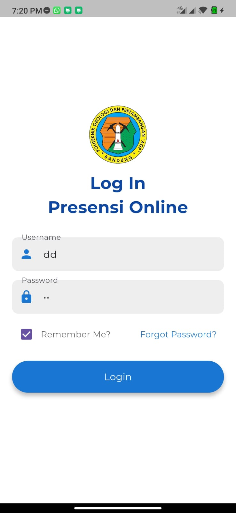

# Flutter Attendance App PKL

"This attendance application was developed as part of the Internship Program (PKL) at Politeknik Geologi dan Pertambangan AGP Bandung. The application is built using Flutter as the development framework and MySQL as the database. The main purpose of this application is to simplify and digitalize the process of recording and managing attendance, making it more effective and efficient compared to manual methods."

### User Interface

  
  

  <b>Login</b> &nbsp;&nbsp;&nbsp;&nbsp;&nbsp; <b>Dashboard</b>

